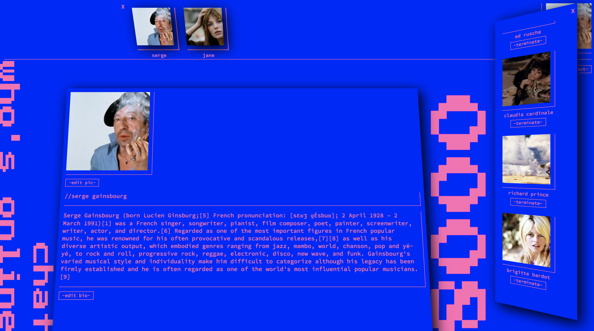

<h1><i>sergeNET</i></h1>

<h2><i>description</i></h2>

A fictitious social network for fans of Serge Gainsbourg, based on Bowie Net.

<h2><i>tech</i></h2>

<strong>Language</strong>: Javascript

<strong>Front-End</strong>: React, Redux, Socket.io

<strong>Back-End</strong>: Node.js, Express, Socket.io

<strong>Database</strong>: PostgresSQL, AWS S3

<h2><i>features</i></h2>
<ul>
    <li>- Create an account</li>
    <li>- Upload a profile picture</li>
    <li>- Edit bio</li>
    <li>- View friends</li>
    <li>- Send, accept and reject friend requests</li>
    <li>- See who else is online</li>
    <li>- Chat with other online users</li>
</ul>

<h2><i>preview</i></h2>

<h2><i>get in touch</i></h2>

<a href="mailto:tobi.seymour@gmail.com">tobi.seymour@gmail.com</a>

<a href="https://www.linkedin.com/in/tobiseymour/">LinkedIn</a>

